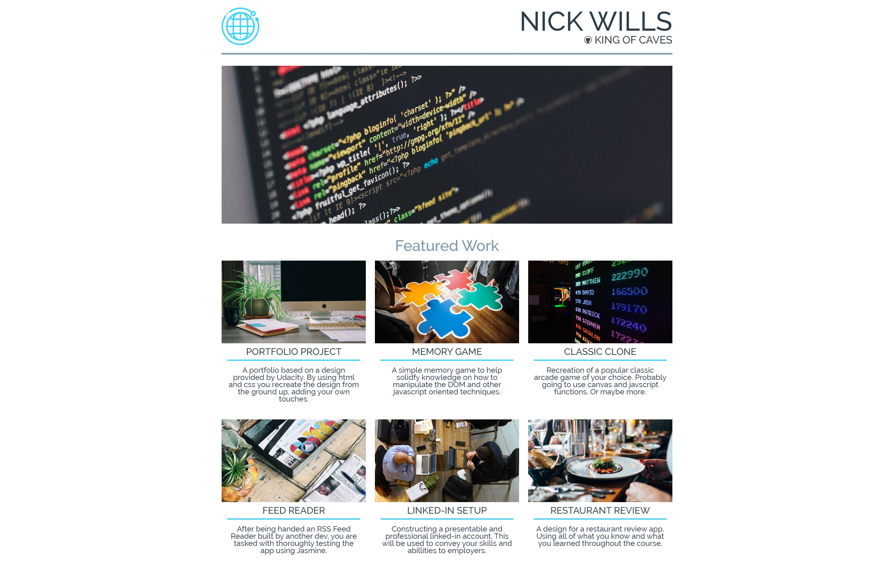
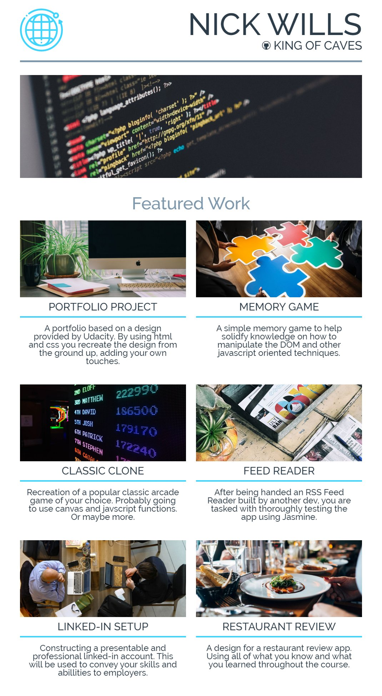
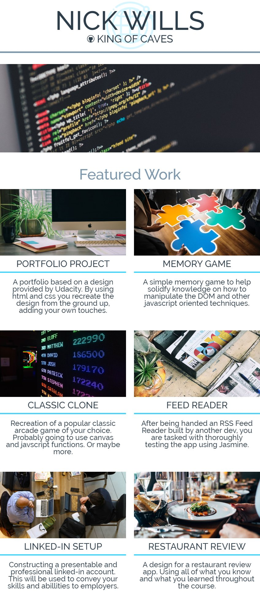
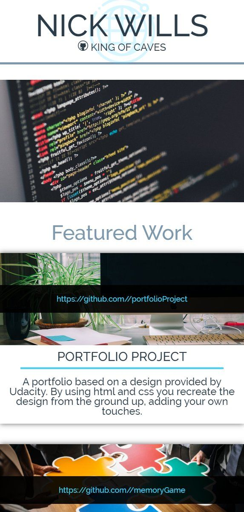

# portfolioProject

## GETTING STARTED
Setting up everything is as easy as downloading, extracting all of the files, then opening the index.html file.

You can also view it [here](https://kingofcaves.github.io/portfolioProject/) through Github Pages.

## WHAT IS IT?
The portfolio project for the Udacity Nanodegree course.

## SCREENSHOTS

### SOURCES AND CREDITS
https://unsplash.com/photos/LTyDj7u_TU4
	- Photo by Element5 Digital

https://unsplash.com/photos/UCoaJKrM808
	- Photo by Branden Harvey

https://unsplash.com/photos/N_Y88TWmGwA
	- Photo by Jay Wennington

https://unsplash.com/photos/jUrku7MmrNY
	- Photo by Michael Aleo

https://unsplash.com/photos/OqtafYT5kTw
	- Photo by Ilya Pavlov

https://unsplash.com/photos/q5AR3dSnVVQ
	- Photo by rawpixel

##### earth-flat.svg made by www.flaticon.com is licensed by CC 3.0 BY
